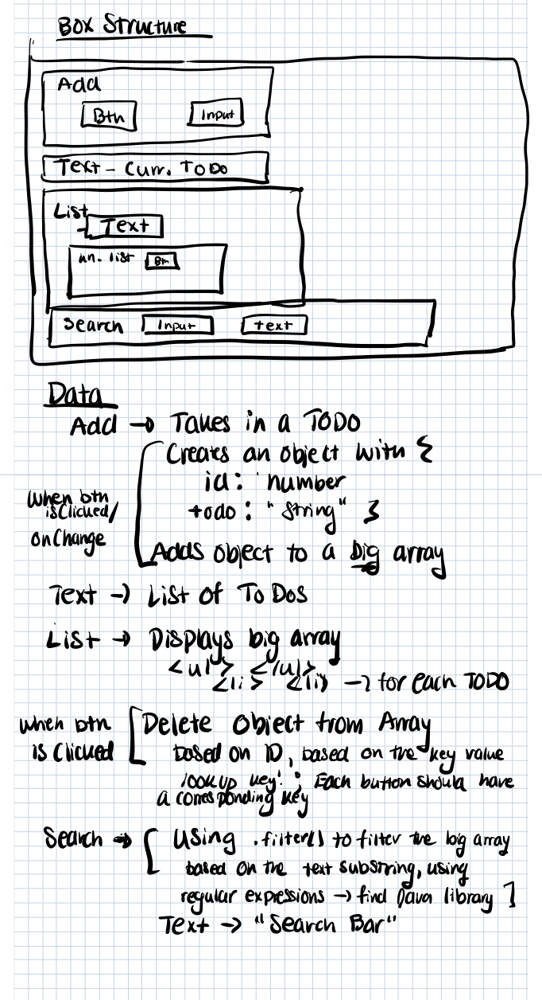

# UI - Design mockup

# Component structure
The app will have the following components:

- Input
- Add
- Search
- Button
- Text
- Todo
- List

The __add__ component will have both the __input__ and __text__ component to take user input and display the add button. The __text__ component will be used to display text _(e.g Current TODOs)_ . The __todo__ component will use both the __list__ component and the __text__ component; if the _todo list_ is empty, it will use __text__ component, else it will use __list__ component. The __list__ component will display list items. The __search__ component will use both the __input__ and __text__ component to take user input and display th search text.

# Data
All components will need to have access to the Todo list, which stores todo list key-value pairs. They will need to know whether todo list is empty or not as this will determine which components are displayed, and which ones aren't.